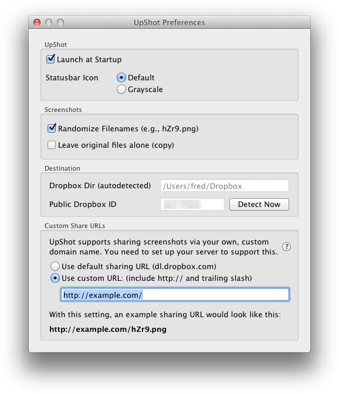

**UpShot** combines the power of OS X's built-in screenshot functionality with Dropbox. This makes UpShot the easiest way to automatically upload and share screenshots on OS X.

**UpShot in three easy steps:**

1. You **take a screenshot**
2. The screenshot URL shows up in your clipboard, **ready to be pasted** wherever you want.
3. Actually, there is no step 3!

<a href="http://dl.upshot.it/UpShot-{{ page.versions|first|first }}.dmg" class="button">Download UpShot</a>

.dmg file, version {{ page.versions|first|first }}, {{ page.versions|first|last}}

### Installing UpShot
* Download the DMG file above, double click to open
* drag the UpShot app into your ``/Applications`` directory (overwrite the existing version when updating).
* go to the Applications directory and start UpShot from there. UpShot will show up in your status bar in the top right corner of the screen.

### Screenshots

### Stay up to date
The easiest way to stay up to date with development on UpShot is following [UpShot_it on Twitter][twitter]. Every [blog post][blog] and update will be announced there.

Here are the latest posts:

<a class="twitter-timeline" data-dnt="true" href="https://twitter.com/UpShot_it" data-widget-id="279318266516742144">Tweets by @UpShot_it</a>

[twitter]: https://twitter.com/UpShot_it
[blog]: http://fredericiana.com/tag/upshot/

### Contributing

UpShot is an open source project on [Github][upshot-gh], written in Python. Issues and Pull Requests are highly appreciated!

The [README][readme] file also has additional technical info on how UpShot works.

[upshot-gh]: https://github.com/fwenzel/upshot/
[readme]: https://github.com/fwenzel/upshot#readme

### Version History
For a summary of what changed between versions, check out the [changelog][changelog].

If you know what you're doing, you may download previous versions here:


* [v{{ v|first }} ({{ v|last }})](http://dl.upshot.it/UpShot-{{ v|first }}.dmg)

[changelog]: https://github.com/fwenzel/upshot/blob/master/CHANGELOG.md

### License
Copyright (c) {{ 'now' | date: '%Y' }} [Fred Wenzel](http://fredericiana.com).

UpShot is released under a BSD license. Read the file [``LICENSE``][license] for more information.

[license]: https://github.com/fwenzel/upshot/blob/master/LICENSE
